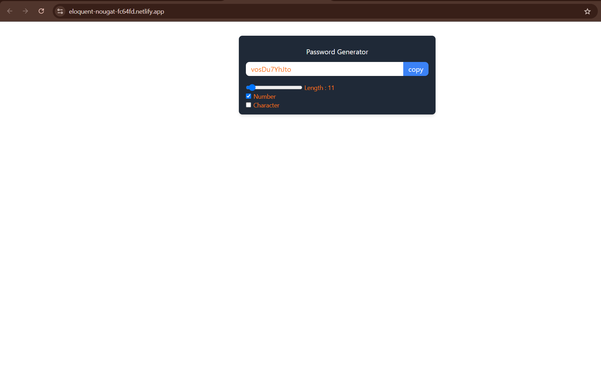

# 🔐 Password Generator

A sleek and customizable password generator built using **React** and **Tailwind CSS**. Generate secure passwords of any length, with options to include numbers and special characters.

## 🌟 Features

- Generate random passwords instantly
- Customize password length (from 6 to 100)
- Include/exclude:
  - Numbers (0–9)
  - Special characters (!@#$%^&*()_+)
- Copy the generated password to your clipboard with one click
- Responsive and modern UI using Tailwind CSS

## 🚀 Demo



## 📦 Installation

1. Clone the repository:

```bash
git clone https://github.com/your-username/password-generator.git
cd password-generator
```
2. Install dependencies:
```bash
npm install
```
3. Run the app
```bash
npm run dev
```
The app will run locally at http://localhost:3000
